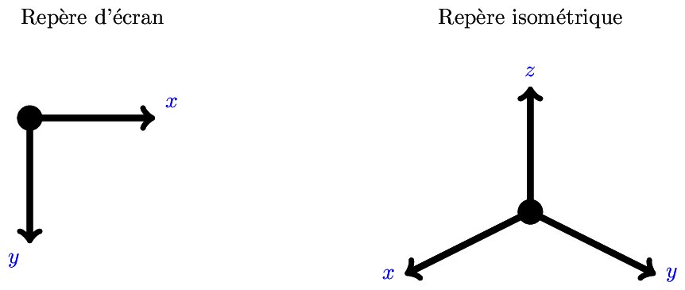

## Description

Ce programme permet de générer des [cartes
isométriques](https://en.wikipedia.org/wiki/Isometric_projection). Une carte
isométrique est une carte en pseudo-3D dans laquelle apparaissent des tuiles,
qui sont simplement des images. Voici des exemples de telles cartes:

| Une petite carte       | Une plus grande carte    |
| ---------------------- | ------------------------ |
|  |  |

Les tuiles utilisées pour produire ces carte se trouvent dans le répertoire
`art`. Elles ont été conçues à l'aide du logiciel libre
[Blender](https://www.blender.org/).

Une carte est représentée par une chaîne qui respecte le format
[JSON](http://www.json.org/json-fr.html). Par exemple, la petite carte plus
haut est décrite à l'aide du fichier suivant:

```json
{
    "tile-width": 64,
    "z-offset": 19,
    "tileset":
        [
            {
                "id": 1,
                "filename": "./art/end-64x64.png",
                "incoming": [[1,0,-1], [-1,0,-1], [0,1,-1], [0,-1,-1]],
                "outgoing": [[1,0,-1], [-1,0,-1], [0,1,-1], [0,-1,-1]]
            },
            {
                "id": 2,
                "filename": "./art/flat-64x64.png",
                "incoming": [[1,0,0], [-1,0,0], [0,1,0], [0,-1,0],
                             [1,0,1], [-1,0,1], [0,1,1], [0,-1,1]],
                "outgoing": [[1,0,0], [-1,0,0], [0,1,0], [0,-1,0],
                             [1,0,1], [-1,0,1], [0,1,1], [0,-1,1]]
            },
            {
                "id": 3,
                "filename": "./art/start-64x64.png",
                "incoming": [[1,0,-1], [-1,0,-1], [0,1,-1], [0,-1,-1]],
                "outgoing": [[1,0,-1], [-1,0,-1], [0,1,-1], [0,-1,-1]]
            }
        ],
    "layers":
        [
            {
                "num-rows": 3,
                "num-cols": 3,
                "offset": [0, 0, 0],
                "data": [2, 2, 2,
                         2, 2, 2,
                         2, 2, 2]
            },
            {
                "num-rows": 3,
                "num-cols": 3,
                "offset": [0, 0, 1],
                "data": [1, 0, 0,
                         0, 0, 0,
                         0, 0, 3]
            }
        ]
}
```

La petite carte a été générée à l'aide de la commande

```sh
$ bin/isomap -f png -o images/map3x3.png < data/map3x3.json
```

Elle peut aussi être affichée au format texte:

```sh
Tileset of 3 tiles:
  Tile id=1
    incoming directions: vect(1,0,-1),vect(-1,0,-1),vect(0,1,-1),vect(0,-1,-1)
    outgoing directions: vect(1,0,-1),vect(-1,0,-1),vect(0,1,-1),vect(0,-1,-1)
  Tile id=2
    incoming directions: vect(1,0,0),vect(-1,0,0),vect(0,1,0),vect(0,-1,0),vect(1,0,1),vect(-1,0,1),vect(0,1,1),vect(0,-1,1)
    outgoing directions: vect(1,0,0),vect(-1,0,0),vect(0,1,0),vect(0,-1,0),vect(1,0,1),vect(-1,0,1),vect(0,1,1),vect(0,-1,1)
  Tile id=3
    incoming directions: vect(1,0,-1),vect(-1,0,-1),vect(0,1,-1),vect(0,-1,-1)
    outgoing directions: vect(1,0,-1),vect(-1,0,-1),vect(0,1,-1),vect(0,-1,-1)
A map of 2 layers
  Layer 0: A layer of 3 rows and 3 columns (offset = (0,0,0))
    2 2 2 
    2 2 2 
    2 2 2 
  Layer 1: A layer of 3 rows and 3 columns (offset = (0,0,1))
    1 0 0 
    0 0 0 
    0 0 3 
```

## Installation et fonctionnement

Assurez-vous d'abord d'avoir installé toutes les dépendances nécessaires au
fonctionnement (voir la section [Dépendances](#dépendances)).

Ensuite, il suffit de compiler avec la commande

~~~bash
make
~~~

qui va notamment produire un exécutable `bin/isomap`. Vous pouvez ensuite
invoquer l'exécutable depuis la racine du projet. Par exemple, pour afficher
l'aide, il suffit d'activer l'option `-h` ou `--help`:

```sh
$ bin/isomap -h

Usage: bin/isomap [-h|--help] [-s|--start X,Y,Z] [-e|--end X,Y,Z]
    [-w|--with-walk] [-f|--output-format FORMAT]
    [-i|--input-filename PATH] [-o|--output-filename PATH]

Generate an isometric map from a JSON file. The file must respect
the right JSON format. See the README file for more details.
By default, read the file on stdin and write the result on stdout.

Optional arguments:
  -h|--help                  Show this help message and exit.
  -s|--start X,Y,Z           The start location (X,Y,Z) in the map.
                             Default value is (0,0,0).
  -e|--end X,Y,Z             The end location (X,Y,Z) in the map.
                             Default value is (1,1,0).
  -w|--with-walk             Also display a shortest walk between
                             the start and end locations.
  -f|--output-format FORMAT  Select the ouput format (either text,
                             or png). The default format is text.
  -i|--input-filename PATH   Read the JSON file from the file PATH
                             If present, ignore stdin.
  -o|--output-filename PATH  Write the output to the file PATH.
                             Mandatory for the PNG output format.
                             If present, does not write on stdout.
```

## Auteur

Alexandre Blondin Massé

## Repère dans le plan et dans l'espace

Comme on dessine des cartes sur des images, on doit nécessairement appliquer
une projection d'un espace 3D (la carte) vers un espace 2D (l'image). Dans le
cas présent, nous nous basons sur les repères suivants pour les coordonnées
d'écran et les coordonnées isométriques:



Autrement dit, nous avons les interprétations suivantes pour les coordonnées
d'écran:

* Un déplacement vers la *droite* (resp. *gauche*) correspond à un déplacement
  positif (resp. négatif) en la direction donnée par $`x`$
* Un déplacement vers le *bas* (resp. *haut*) correspond à un déplacement
  positif (resp. négatif) en la direction donnée par $`y`$

Et pour les coordonnées isométriques:

* Un déplacement vers la *prochaine ligne* (resp. *ligne précédente*)
  correspond à un déplacement positif (resp. négatif) en la direction donnée
  par $`x`$
* Un déplacement vers la *prochaine colonne* (resp. *colonne précédente*)
  correspond à un déplacement positif (resp. négatif) en la direction donnée
  par $`y`$
* Un déplacement vers la *couche supérieure* (resp. *couche inférieure*)
  correspond à un déplacement positif (resp. négatif) en la direction donnée
  par $`z`$

Ce choix facilite l'affichage des tuiles des couches inférieures vers les
couches supérieures, et des tuiles situées en arrière vers les tuiles situées
en avant pour une même couche.

## Format JSON

Tel que mentionné plus haut, les cartes sont représentées à l'aide du format
JSON. Les spécifications sont les suivantes:

- Le fichier JSON contient un unique objet.
- Cet objet doit obligatoirement avoir les clés `tile-width`, `z-offset`,
  `tileset` et `layers`.
- La clé `tile-width` doit indiquer la largeur d'une image qui contient une
  tuile individuelle (généralement une puissance de 2)
- La clé `z-offset` doit indiquer le décalage vertical (en pixels) entre deux
  couches (*layers*).
- La clé `tileset` doit contenir une liste d'objets JSON qui contiennent des
  informations sur les tuiles. Une tuile est identifiée par les éléments
  suivants:

  * Une valeur `id` numérique unique
  * Un nom de fichier `filename` qui indique où se trouve l'image correspondant
    à la tuile. Si le chemin de l'image est relatif, il doit être relatif au
    répertoire duquel est invoqué le programme.
  * Une liste `incoming`, qui donne la liste des déplacements permis lorsqu'on
    vient *vers* la tuile (*incoming move*). Ces déplacements sont identifiés
    par des triplets `[dx,dy,dz]` indiquant le déplacement permis au niveau des
    lignes (`dx`), des colonnes (`dy`) et entre les couches (`dz`).
  * Une liste `outgoing`, qui donne la liste des déplacements permis lorsqu'on
    *quitte la tuile* (*outgoing move*). Ces déplacements sont identifiés par
    des triplets `[dx,dy,dz]` indiquant le déplacement permis au niveau des
    lignes (`dx`), des colonnes (`dy`) et entre les couches (`dz`).

- La clé `layers`, qui donne une liste d'objet JSON qui contiennent des
  informations sur chaque couche. Une couche (en anglais, _layer_) est
  identifiée par les données suivantes:

  * Une clé `num-rows` qui indique le nombre de lignes de la couche.
  * Une clé `num-cols` qui indique le nombre de colonnes de la couche.
  * Une clé `offset` qui indique le décalage `[dx,dy,dz]` de la couche par
    rapport à l'origine.
  * Un tableau unidimensionnel `data` de longueur `num-rows * num-cols`
    indiquant la tuile qui apparaît dans chacune des cellules de la carte, en
    utilisant son identifiant numérique. Les cellules sont énumérées ligne par
    ligne.

Afin de simplifier la programmation, la bibliothèque
[Jansson](http://www.digip.org/jansson/) est utilisée pour charger une carte en
format JSON.

## Cairo

Les cartes produites au format PNG sont générées à l'aide de la bibliothèque
[Cairo](https://cairographics.org/), dont la documentation est disponible en
ligne. Une installation de cette bibliothèque est nécessaire pour faire
fonctionner le projet.

## Plateformes supportées

Testé sur Ubuntu 18.04.

## Dépendances

* [PKG-config](https://www.freedesktop.org/wiki/Software/pkg-config/), un
  logiciel facilitant la compilation et l'édition des liens lorsqu'on utilise
  des bibliothèques tierces.
* [Cairo](https://cairographics.org/), une bibliothèque permettant de générer
  des images au format PNG.
* [Jansson](http://www.digip.org/jansson/), une bibliothèque permettant de
  manipuler des chaînes de caractères et des fichiers au format JSON.
* [Bats](https://github.com/bats-core/bats-core), pour les tests unitaires
  externes. La commande `bats` doit être disponible pour lancer les tests avec
  `make test`.
* [Libtap](https://github.com/zorgnax/libtap), une bibliothèque permettant de
  mettre en place des tests unitaires internes. Il est probable que vous ayez
  besoin de lancer la commande `ldconfig` après l'installation. Cette
  bibliothèque doit être installée pour que la commande `make test` fonctionne
  correctement.

## License

Le contenu de ce projet est sous [licence GPLv3](https://www.gnu.org/licenses/gpl-3.0.en.html).
