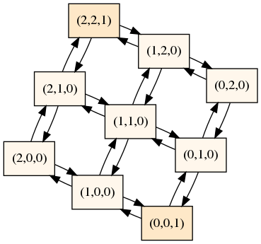
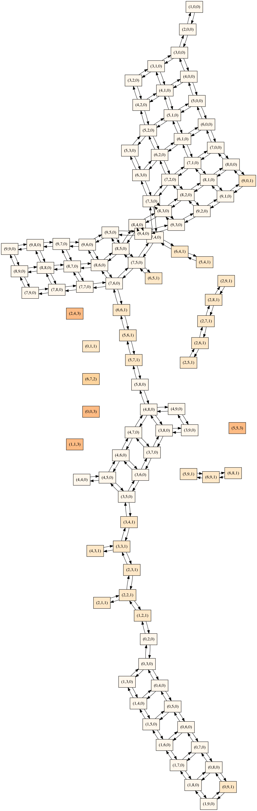
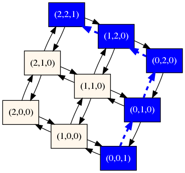
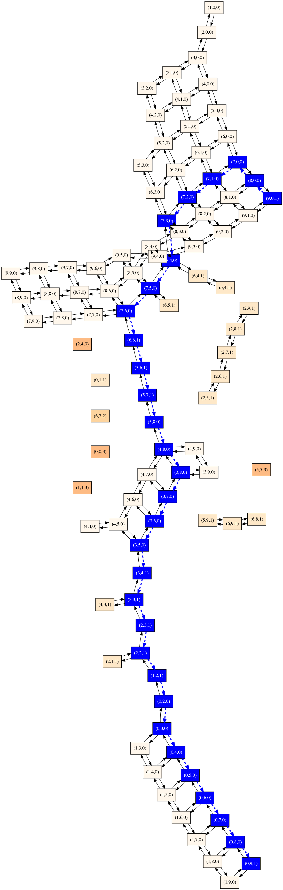
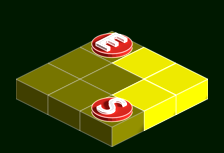
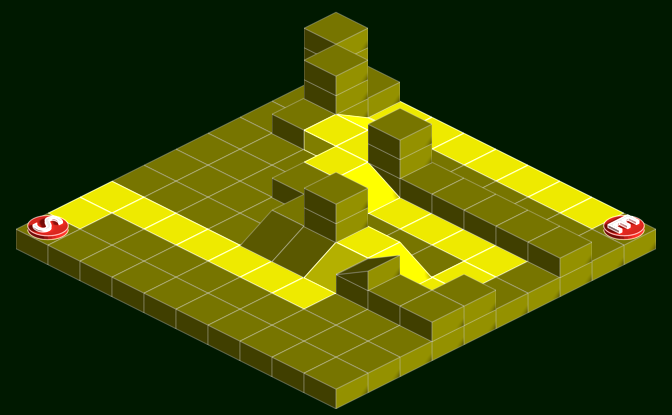

Dans ce deuxième travail pratique, vous devez apporter des modifications à un
programme qui permet de générer des [cartes
isométriques](https://fr.wikipedia.org/wiki/Perspective_isom%C3%A9trique).

Le travail doit être réalisé **seul**. Il doit être remis au plus tard le **26
juillet 2020** à **23h59**.  À partir de minuit, une pénalité de **2% par
heure** de retard sera appliquée.

## Objectifs spécifiques

Les principaux objectifs visés sont les suivants :

* Se **familiariser** avec un logiciel développé en C par quelqu'un d'autre
* Apprendre à utiliser des **bibliothèques tierces** à l'intérieur d'un
  programme C, en consultant la documentation disponible
* Organiser le développement des modifications à l'aide de **branches**
* Soumettre les **modifications** en utilisant des **requêtes d'intégration**
  (*merge requests*)
* **Documenter** convenablement des requêtes d'intégration à l'aide du format
  Markdown
* S'assurer que les modifications apportées sont adéquates en proposant ou en
  mettant à jour un **cadre de tests** qui montre que les modifications
  n'entraînent pas de régression

## Description du travail

Rendez-vous sur
[https://gitlab.info.uqam.ca/inf3135-ete2020/inf3135-ete2020-tp2](https://gitlab.info.uqam.ca/inf3135-ete2020/inf3135-ete2020-tp2),
où se trouve le générateur de cartes isométriques. Avant-même de créer une
copie (*fork*), prenez le temps de bien vous familiariser avec la structure du
projet, les fichiers disponibles, le code source et le fonctionnement général
du programme.

**Note**: ne négligez pas cette étape importante. Vous devez prévoir un certain
temps pour comprendre le programme avant même d'écrire une seule ligne de code!

Votre travail consiste à compléter les quatre tâches ci-bas. Bien que ce ne
soit pas obligatoire, il est recommandé de les implémenter dans l'ordre
présenté.

### Tâche 1: Régler les fuites de mémoire (`memory-leak`)

En l'état actuel, le programme entraîne des fuites de mémoire lorsqu'il est
invoqué dans certaines situations. À l'aide de l'outil
[Valgrind](https://valgrind.org/), identifiez les sources de ces fuites et
apportez les correctifs nécessaires.

Vos modifications devront être sauvegardées sur une branche nommée
`memory-leak`, basée sur le *commit* le plus récent de la branche `master`.

### Tâche 2: Générer un fichier DOT du graphe de la carte (`dot-output`)

Les formats actuellement supportés par le programme sont `text` et `png`. Votre
deuxième tâche consistera à ajouter un troisième format possible appelé `dot`
qui affichera la carte au format DOT de [Graphviz](https://graphviz.org/).

Par exemple, les commandes

```sh
$ bin/isomap -f dot < data/map3x3.json | neato -Tpng -o graph3x3.png
$ bin/isomap -f dot < data/map3x3.json | neato -Tpng -o graph10x10.png
```

devraient produire des fichiers `graph3x3.png` et `graph10x10.png` dont les
images ressemblent aux suivantes.

| `graph3x3.png`                                                | `graph10x10.png`                                                |
| ------------------------------------------------------------- | --------------------------------------------------------------- |
|  |  |

Ces graphes représentent les déplacements possibles entre les différentes
tuiles, ce qui permet d'avoir une représentation logique d'une carte,
complémentaire à la représentation visuelle obtenue avec l'option `-f png`. Il
n'est pas obligatoire de colorier les noeuds comme dans les exemples ci-haut
(un schéma de couleur a été utilisé, de telle sorte que, plus une tuile est
foncée, plus elle est sur une couche élevée), mais la relation d'adjacence
entre les noeuds devrait être la même.

Vos modifications devront être regroupées sur une branche nommée `dot-output`,
également basée sur le *commit* le plus récent de la branche `master`.
N'oubliez pas d'intervenir aux endroits pertinents pour tenir compte de la
nouvelle option:

* **Code source C**: pour implémenter la nouvelle fonctionnalité.
* **Manuel d'utilisation**: pour afficher la nouvelle fonctionnalité quand on
  entre `bin/isomap -h`
* **Fichier `README.md`**: donnez un exemple d'utilisation de cette option
  (commande à invoquer et image résultante)
* **Tests unitaires**: ajoutez quelques tests montrant que l'option est
  maintenant disponible.

### Tâche 3: Valider la lecture d'une carte au format JSON (`validate-json`)

Lorsque le programme charge une carte isométrique depuis un fichier JSON,
aucune validation n'est faite: le programme suppose que le format JSON est bien
respecté, que les données disponibles sont intègres et que les fichiers des
images dessinées existent bien.

Ce comportement rend difficile le débogage lorsque les données sont corrompues,
car il peut soulever des erreurs de segmentation ou des comportements
indéterminés.

Dans cette tâche, vous devez améliorer la robustesse de votre programme et, en
cas d'erreur, afficher des messages d'erreur plus faciles à interpréter pour le
développeur ou la développeuse. Vous devrez également ajouter des tests
unitaires permettant de montrer que vos modifications détectent différents
scénarios erronés. Vous devrez probablement ajouter des exemples de fichiers
JSON invalides dans le répertoire `data`.

Vos modifications devront être regroupées sur une branche nommée
`validate-json`, basée sur le *commit* le plus récent de la branche `master`.

### Tâche 4: Tracer un chemin entre le départ et l'arrivée (`draw-walk`)

Actuellement, l'option `-w` est seulement supportée pour le format `text` et
elle est simplement ignorée pour le format `png`.

Dans cette tâche, vous devez activer le tracé d'une marche (*walk*) ou chemin
orienté (*directed path*) pour les formats `png` et `dot`. Vous êtes libres
d'utiliser n'importe quel mécanisme visuel pour identifier le chemin. Par
exemple, vous pourriez:

* Pour l'option `dot`: colorier les sommets et les flèches qui font partie de
  la marche dans le graphe généré par Graphviz. Par exemple, on s'attend à ce
  que les deux commandes suivantes produisent les deux images qui suivent.

```sh
$ bin/isomap -f dot -w -s 0,0,1 -e 2,2,1 < data/map3x3.json | neato -Tpng -o graph3x3-w.png
$ bin/isomap -f dot -w -s 9,0,1 -e 0,9,1 < data/map10x10-64x64.json | neato -Tpng -o graph10x10-w.png
```

| `graph3x3-w.png`                                                | `graph10x10-w.png`                                                |
| --------------------------------------------------------------- | ----------------------------------------------------------------- |
|  |  |

* Pour l'option `png`: colorier en plus clair les tuiles qui font partie de la
  marche dans l'image générée par Cairo. Par exemple, on s'attend à ce que les
  deux commandes suivantes produisent les deux images qui suivent.

```sh
$ bin/isomap -f png -w -s 0,0,1 -e 2,2,1 -o map3x3-w.png < data/map3x3.json
$ bin/isomap -f png -w -s 9,0,1 -e 0,9,1 -o map10x10-w.png < data/map10x10-64x64.json
```

| `map3x3-w.png`           | `map10x10-w.png`           |
| ------------------------ | -------------------------- |
|  |  |

Vos modifications devront être regroupées sur une branche nommée `draw-walk`,
basée sur le *commit* le plus récent de la branche `dot-output`, puisqu'elle
dépend des modifications apportées dans la tâche 2.

*Astuce*: Pour « surligner » une tuile, il y a plusieurs façons de procéder.
Une possibilité consiste à dessiner la tuile deux fois au même endroit en
utilisant l'opérateur `CAIRO_OPERATOR_ADD` de Cairo, ce qui aura pour effet
d'éclaircir le visuel. Noter que tout autre effet visuel montrant clairement
que la tuile est « surlignée » peut être utilisé dans cette tâche.

### Dépendance/indépendance entre les tâches

Il est important de bien diviser les branches et les *commits* selon les tâches
auxquelles ils se rapportent. Assurez-vous que la « topologie » de vos
contributions reflète clairement les dépendances ou l'indépendance des
branches.

## Soumettre une contribution

Un des objectifs de ce travail pratique est de vous habituer à soumettre vos
modifications en utilisant les mécanismes offerts par le logiciel de contrôle
de versions Git et les plateformes de développement collaboratif telles que
GitLab. Plus précisément, vous devrez utiliser une *requête d'intégration* (en
anglais, *merge request*, aussi parfois appelée *pull request*). Pour cela,
vous devrez créer une branche pour chacune des tâches demandées. Afin de
simplifier la correction, il est important de respecter **exactement** la
nomenclature suggérée (`memory-leak`, `validate-json`, `dot-output`,
`draw-walk`).

Dans un premier temps, vous devez répliquer (en anglais *fork*) le programme de
base disponible. Assurez-vous de bien faire une copie **privée** (sinon les
autres étudiantes et étudiants du groupe pourront voir votre solution et vous
serez alors responsable s'il y a plagiat). Ensuite, vous devrez donner accès
à votre projet en mode *Maintainer* à l'utilisateur `blondin_al`.

Supposons que vous avez complété la branche `memory-leak` sur votre dépôt local
et que vous souhaitez la partager. Alors il vous suffit de pousser la branche
`memory-leak` sur votre propre dépôt puis de créer une requête d'intégration de
la branche `memory-leak` à la branche `master` (toujours dans votre dépôt). Il
est recommandé de vous inspirer de la
[task0](https://gitlab.com/ablondin/inf3135-aut2017-tp2/merge_requests/1) pour
un exemple de requête bien rédigée.

Notez qu'il est possible en tout de temps de mettre à jour le titre et la
description d'une requête d'intégration. Il est aussi possible de mettre à jour
la branche correspondante. Ainsi, n'hésitez pas à faire des essais et à adapter
le tout au fur et à mesure que vous avancez dans votre projet.

**Attention!** Dans votre travail, il est important de **ne pas** fusionner de
branche lors de la remise de votre travail, car vous devez attendre que vos
modifications soient validées par quelqu'un d'autre, en l'occurrence, votre
enseignant. En pratique, on fait une requête d'intégration d'une branche de
notre dépôt personnel (`origin`) vers le dépôt principal (`upstream`).
Cependant, dans ce contexte académique, la requête doit être faite
à l'intérieur de votre dépôt privé, pour vous assurer que personne d'autre ne
puisse consulter votre code. Ainsi, toutes vos requêtes se feront d'une branche
vers la branche `master` de votre propre dépôt.

## Tests automatiques

Actuellement, lorsqu'on entre la commande

```sh
$ make test
```

une suite de tests est lancée. Lorsque vous apporterez des modifications au
programme, vous devez vous assurer que celles-ci ne brisent pas les suites de
tests (autrement dit, il s'agit de **tests de régression** et vous devez en
tenir compte dans vos modifications).

Lorsque vous allez apporter des modifications au logiciel, vous devrez
également ajouter ou modifier des suites de tests afin d'illustrer que ce que
vous avez fait est fonctionnel et ne brise pas l'état actuel du projet.

## Contraintes

Afin d'éviter des pénalités, il est important de respecter les contraintes
suivantes:

- Votre projet doit être un clone (*fork*) **privé** du projet
  https://gitlab.com/inf3135-ete2020/inf3135-ete2020-tp2. L'adjectif **privé**
  est très important si vous ne voulez pas que d'autres étudiants accèdent
  à votre solution!
- Vos quatre tâches doivent se trouver sur des branches nommées **exactement**
  `memory-leak`, `validate-json`, `dot-output` et `draw-walk`
- **Aucune requête d'intégration** ne doit être faite vers le dépôt public
  (sans quoi les autres étudiants pourront voir vos modifications!)
- **Aucune requête d'intégration** ne doit être fusionnée sur la branche
  `master` (ou tout autre branche), car elle doit d'abord être validée par
  quelqu'un d'autre (l'enseignant ou le correcteur) avant d'être intégrée,
  étape qui ne sera pas couverte dans le présent travail pratique
- **Aucune variable globale** (à l'exception des constantes) n'est permise
- Votre programme doit **compiler** sans **erreur** et sans **avertissement**
  lorsqu'on entre ``make``.

Advenant le non-respect d'une ou plusieurs de ces contraintes, une pénalité
pouvant aller jusqu'à **50%** de la note totale pourrait être appliquée.

## Remise

Votre travail doit être remis au plus tard le **26 juillet 2020** à **23h59**.
À partir de minuit, une pénalité de **2% par heure** de retard sera appliquée.

La remise se fait **obligatoirement** par l'intermédiaire de la plateforme
[GitLab du département](https://gitlab.info.uqam.ca/). **Aucune remise par
courriel ne sera acceptée** (le travail sera considéré comme non remis).

Les travaux seront corrigés sur Linux ou sur le serveur Java. Vous devez donc
vous assurer que votre programme fonctionne **sans modification** sur au moins
une de ces deux plateformes.

## Barème

Pour chacune des quatre tâches, les critères suivants seront pris en compte
dans l'évaluation:

**Documentation du code source**

* Les *docstrings* respectent le standard Javadoc
* La documentation est bien formatée et bien aérée
* Le format est cohérent avec les autres *docstrings* déjà présentes dans le
  projet
* La *docstring* ne contient pas d'erreurs d'orthographe

**Qualité de la requête d'intégration (*merge request*)**

* Le titre de la requête est significatif
* La description de la modification apportée est claire, concise et précise. En
  particulier, elle respecte le format Markdown et l'exploite à son maximum.
* Le comportement du programme avant modification est décrit
* Le comportement du programme après modification est décrit
* La branche de la requête est basée sur le *commit* le plus récent de la
  branche `master`, ou d'une autre branche si elle en dépend
* La branche ne contient que des *commits* pertinents
* Les *commits* effectuent des modifications bien spécifiques
* Les messages de *commits* sont significatifs et ont un format cohérent avec
  les messages rédigés par les autres développeurs
* La requête ne contient pas d'erreurs d'orthographe

**Qualité du changement de code**

* Le code modifié est lisible, clair et concis
* Le code est bien aéré, de façon cohérente avec le style de programmation déjà
  existant
* Il utilise au maximum les fonctionnalités déjà présentes (ne pas réinventer
  la roue)
* Il est bien factorisé
* La solution n'est pas inutilement complexe

**Fonctionnalité**

* Les modifications apportées répondent à ce qui est demandé
* Les modifications ne brisent pas les tests déjà présents
* S'il y a lieu, des tests sont ajoutés pour illustrer le fait que les
  nouvelles fonctionnalités ont été correctement implémentées

La pondération pour chacune des tâches est distribuée comme suit:

| Tâche                     | Documentation | Requête   |   Code    | Fonctionnalité |  Total    |
| ------------------------- | ------------- | --------- | --------- | -------------- | --------- |
| Tâche 1: `memory-leak`    |      0        |     8     |     4     |       8        |    20     |
| Tâche 2: `dot-output`     |      4        |     8     |     5     |       8        |    25     |
| Tâche 3: `validate-json`  |      5        |    10     |     5     |      10        |    30     |
| Tâche 4: `draw-walk`      |      4        |     8     |     5     |       8        |    25     |
| **Total**                 |   **13**      |  **34**   |  **19**   |    **34**      | **100**   |
